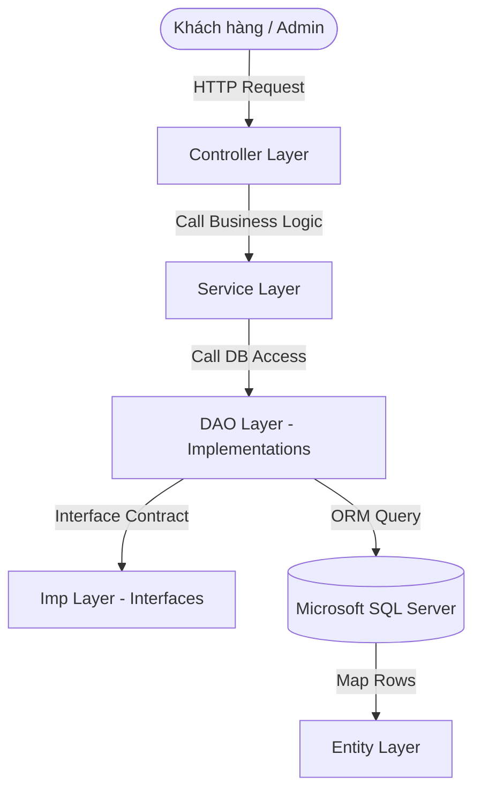

# 👕 Dự Án Quản Lý Web Áo Quần (QuanLyWebaoQuan)

Dự án **QuanLyWebaoQuan** là một ứng dụng web hoàn chỉnh phục vụ cho việc quản lý và kinh doanh thời trang (quần áo) trực tuyến. Hệ thống được phát triển dựa trên mô hình **MVC (Model-View-Controller)** sử dụng framework **Spring Boot** kết hợp với cơ sở dữ liệu **Microsoft SQL Server** và giao diện **JSP (JavaServer Pages)**.

---

## 🛠️ Công Nghệ Sử Dụng (Tech Stack)

### Backend
*   **Ngôn ngữ chính:** Java 21
*   **Framework:** Spring Boot 3.5.12 (Spring Web, Spring Data JPA, Spring Mail)
*   **ORM / Database Access:** Hibernate / JPA (EntityManager custom DAOs)
*   **Thư viện hỗ trợ:** Lombok 1.18.42 (giúp tinh gọn code boilerplate)
*   **JSON Parser:** Google Gson (xử lý dữ liệu JSON dạng chuỗi)
*   **Format code:** Spotless Plugin với Google Java Format

### Database
*   **Hệ quản trị CSDL:** Microsoft SQL Server
*   **Kết nối CSDL:** `mssql-jdbc`
*   **Tính năng tự động tạo bảng:** `hibernate.hbm2ddl.auto=update`

### Giao Diện (Frontend)
*   **Template Engine:** JSP (JavaServer Pages) hỗ trợ qua Tomcat Embed Jasper
*   **Thư viện tag:** Jakarta Standard Tag Library (JSTL) API & Glassfish JSTL implementation
*   **Rich Text Editor:** Tích hợp CKEditor hỗ trợ viết mô tả sản phẩm phong phú
*   **Giao diện tĩnh:** Tách biệt tài nguyên CSS, JS và hình ảnh dành cho phân hệ `user` và `admin` tại thư mục `/resourcess/`

### Kiểm Thử (Unit Testing)
*   **Framework chính:** JUnit 5 (JUnit Jupiter)
*   **Giả lập:** Mockito (hỗ trợ cô lập các tầng dịch vụ và controller)
*   **Kiểm thử Web:** Spring Boot Test & MockMvc
*   **Cơ sở dữ liệu in-memory:** H2 Database (hỗ trợ chạy test database không cần SQL Server thực tế)

---

## 🏗️ Kiến Trúc Hệ Thống (System Architecture)

Dự án tuân thủ mô hình phân tầng chuẩn trong phát triển ứng dụng Spring Boot:



1.  **Entity Layer (`com.banhang.entity`):** Định nghĩa các thực thể ánh xạ trực tiếp đến các bảng trong CSDL sử dụng các annotation JPA (`@Entity`, `@Table`, `@Id`, `@Column`, `@ManyToOne`, v.v.).
2.  **Imp Layer (`com.banhang.imp`):** Tập hợp các Interface định nghĩa khuôn mẫu và các phương thức cần có cho các thao tác CSDL.
3.  **DAO Layer (`com.banhang.dao`):** Hiện thực các Interface trong tầng Imp, trực tiếp thao tác với cơ sở dữ liệu thông qua `@PersistenceContext EntityManager`.
4.  **Service Layer (`com.banhang.service`):** Xử lý nghiệp vụ logic (Business Logic), trung chuyển dữ liệu giữa Controller và DAO, quản lý giao dịch (`@Transactional`).
5.  **Controller Layer (`com.banhang.controller`):** Tiếp nhận yêu cầu từ client, gọi tầng Service xử lý và điều hướng hiển thị kết quả ra giao diện JSP tương ứng.
    *   `admin/`: Phân hệ quản trị dành cho nhân viên/quản lý.
    *   `user/`: Phân hệ dành cho khách mua sắm.

---

## 📂 Cấu Trúc Thư Mục Dự Án

```text
QuanLyWebaoQuan/
├── .settings/                # Cấu hình IDE (Eclipse/VS Code)
├── src/
│   ├── main/
│   │   ├── java/com/banhang/
│   │   │   ├── Application.java       # File kích hoạt ứng dụng Spring Boot
│   │   │   ├── commons/              # Các hàm dùng chung (tiện ích)
│   │   │   ├── config/               # Cấu hình hệ thống (WebConfig, Spring Security, v.v.)
│   │   │   ├── controller/           # Tầng điều khiển (phân chia admin và user)
│   │   │   ├── dao/                  # Tầng truy xuất cơ sở dữ liệu (EntityManager)
│   │   │   ├── entity/               # Thực thể ánh xạ CSDL JPA
│   │   │   ├── imp/                  # Giao diện (Interface) định nghĩa hành vi DAO
│   │   │   ├── model/                # Data Transfer Objects (DTO) hoặc View Model
│   │   │   └── service/              # Tầng xử lý nghiệp vụ
│   │   ├── resources/
│   │   │   └── application.properties # Cấu hình kết nối CSDL, Mail, Port, View Resolver
│   │   └── webapp/
│   │       ├── resourcess/           # Assets tĩnh (admin, user CSS/JS, CKEditor)
│   │       └── WEB-INF/
│   │           ├── web.xml           # Cấu hình Servlet Web (kích hoạt DispatcherServlet)
│   │           └── view/             # File giao diện JSP cho cả Admin và User
│   └── test/
│       └── java/com/banhang/
│           ├── controller/user/
│           │   └── TrangChuUserControllerTest.java # Test MockMvc cho controller
│           ├── entity/
│           │   └── ChiTietHoaDonIdTest.java        # Test POJO/class thông thường
│           └── service/
│               └── SanPhamServiceTest.java         # Test nghiệp vụ sử dụng Mockito mock DAO
├── pom.xml                   # Cấu hình quản lý thư viện Maven
└── README.md                 # Tài liệu hướng dẫn sử dụng và giới thiệu dự án
```

---

## 🗄️ Mô Hình Dữ Liệu & Các Thực Thể Chính

Hệ thống được thiết kế chặt chẽ với các thực thể liên kết sau:

*   **Sản Phẩm (`SanPham`):** Chứa thông tin cơ bản về quần áo như tên, giá bán, hình ảnh mô tả, và danh mục.
*   **Chi Tiết Sản Phẩm (`ChiTietSanPham`):** Phân rã thuộc tính cụ thể của sản phẩm theo **Màu sắc (`MauSanPham`)** và **Kích thước (`SizeSanPham`)** cùng số lượng tồn kho tương ứng.
*   **Danh Mục (`DanhMucSanPham`):** Quản lý phân loại sản phẩm (ví dụ: Áo thun, Quần jeans, Váy đầm).
*   **Khách Hàng / Nhân Viên (`NhanVien`, `ChucVu`):** Hệ thống tài khoản người dùng và phân quyền (như Admin, Nhân viên bán hàng, Khách hàng).
*   **Giỏ Hàng (`GioHang`):** Quản lý tạm thời các mặt hàng người dùng chọn mua trước khi tiến hành thanh toán.
*   **Hóa Đơn & Chi Tiết (`HoaDon`, `ChiTietHoaDon`):** Lưu trữ thông tin đơn hàng, tổng tiền, ngày mua, và danh sách sản phẩm cùng số lượng của đơn hàng đó.
*   **Khuyến Mãi & Chi Tiết (`KhuyenMai`, `ChiTietKhuyenMai`):** Các chương trình giảm giá được áp dụng lên sản phẩm.

---

## 🚀 Hướng Dẫn Chạy Dự Án

### 1. Chuẩn Bị Môi Trường
*   Cài đặt **Java Development Kit (JDK) 21**.
*   Cài đặt **Microsoft SQL Server** và khởi tạo cơ sở dữ liệu tên là `dbbanhang`.
*   Công cụ lập trình (IDE): IntelliJ IDEA, Eclipse, hoặc VS Code.

### 2. Cấu Hình Cơ Sở Dùi Liệu
Mở file [application.properties](file:///D:/Developer/Data-VSCode/QuanLyWebaoQuan/src/main/resources/application.properties) và chỉnh sửa thông tin kết nối SQL Server của bạn:
```properties
spring.datasource.url=jdbc:sqlserver://localhost:1433;databaseName=dbbanhang;encrypt=true;trustServerCertificate=true;
spring.datasource.username=YOUR_USERNAME
spring.datasource.password=YOUR_PASSWORD
```

### 3. Chạy Unit Test
Để thực thi toàn bộ các Unit test kiểm thử Controller, Service và Entity, sử dụng lệnh sau:
```bash
mvn test
```

### 4. Build và Chạy Ứng Dụng
Sử dụng Maven để build dự án thành file `.war` hoặc khởi chạy trực tiếp thông qua Spring Boot.

*   Chạy bằng lệnh Maven trên terminal:
    ```bash
    mvn clean spring-boot:run
    ```
*   Sau khi ứng dụng khởi chạy thành công, truy cập giao diện tại:
    *   **Trang chủ người dùng (User Storefront):** `http://localhost:8080/`
    *   **Trang quản trị (Admin Dashboard):** `http://localhost:8080/admin`

---

## 🔄 Quy Trình CI/CD & AI Code Review (GitHub Actions)

Dự án được cấu hình quy trình tích hợp liên tục (CI/CD) tự động thông qua GitHub Actions nằm tại thư mục [.github/workflows/ci-cd.yml](file:///D:/Developer/Data-VSCode/QuanLyWebaoQuan/.github/workflows/ci-cd.yml). Quy trình tự động kích hoạt khi có sự kiện **Commit (Push)** hoặc **Tạo Pull Request (Merge Source)** lên các nhánh `main`, `master`, `develop`.

### Các Bước Thực Hiện Trong Pipeline:
1.  **Format Code (`spotless:apply`):** Tự động định dạng code Java theo tiêu chuẩn của Google. Nếu phát hiện thay đổi chưa chuẩn, hệ thống tự động sửa đổi và commit ngược lại nhánh hiện tại (sử dụng Git Auto Commit).
2.  **Chạy Unit Test (`mvn test`):** Tự động khởi tạo môi trường thử nghiệm độc lập và chạy toàn bộ unit test để đảm bảo code mới không làm hỏng tính năng cũ.
3.  **AI Code Review (Gemini 2.5 Flash):** 
    *   *Chỉ áp dụng khi tạo Pull Request.*
    *   Hệ thống sẽ lấy git diff giữa nhánh hiện tại và nhánh đích.
    *   Gọi API **Google Gemini 2.5 Flash** phân tích thay đổi và đưa ra các đánh giá về chất lượng mã nguồn, lỗi logic, bảo mật hay hiệu năng.
    *   Tự động đăng phản hồi trực tiếp thành bình luận (comment) trên Pull Request.
4.  **Tự Động Xóa Nhánh Nguồn (Delete Source Branch):**
    *   *Chỉ áp dụng sau khi một Pull Request được merge thành công.*
    *   Hệ thống tự động thực thi script API xóa nhánh nguồn (feature/source branch) giúp dọn dẹp các nhánh cũ đã hoàn thành công việc. Các nhánh chính như `main`, `master`, `develop`, `release` được bảo vệ và tự động bỏ qua.

> [!IMPORTANT]
> Để chức năng AI Code Review hoạt động, bạn cần cấu hình secret **`GEMINI_API_KEY`** trong phần Settings của Github Repository của bạn.

---

## 🔒 Quy Tắc Bảo Vệ Nhánh (Branch Protection Rules)

Để đảm bảo tính ổn định của mã nguồn trên hai nhánh chính là `main` và `develop`, dự án áp dụng quy tắc nghiêm ngặt: **Không cho phép commit trực tiếp, bắt buộc thực hiện thông qua Pull Request (PR).**

### Các bước cấu hình trên GitHub (dành cho Repository Owner):
1.  Truy cập vào Repository của dự án trên GitHub.
2.  Chọn tab **Settings** ở thanh công cụ phía trên.
3.  Tại menu bên trái, chọn mục **Branches** (nằm dưới mục *Code and automation*).
4.  Tại mục **Branch protection rules**, nhấn nút **Add branch protection rule**.
5.  Cấu hình cho nhánh **`main`**:
    *   **Branch name pattern:** Nhập `main`
    *   Tích chọn **Require a pull request before merging** (Yêu cầu Pull Request trước khi merge).
    *   Tích chọn **Require status checks to pass before merging** (Yêu cầu kiểm thử thành công trước khi merge), sau đó tìm kiếm và tích chọn check `Build, Format and Test` để đảm bảo code compile và pass test mới được merge.
    *   Nhấn **Create** để lưu lại.
6.  Cấu hình cho nhánh **`develop`**:
    *   Thực hiện tương tự các bước trên với **Branch name pattern** là `develop`.


